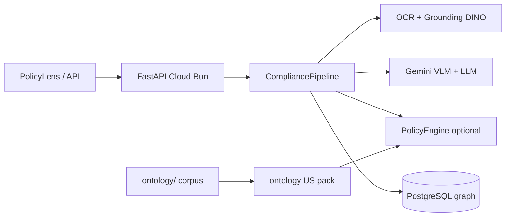
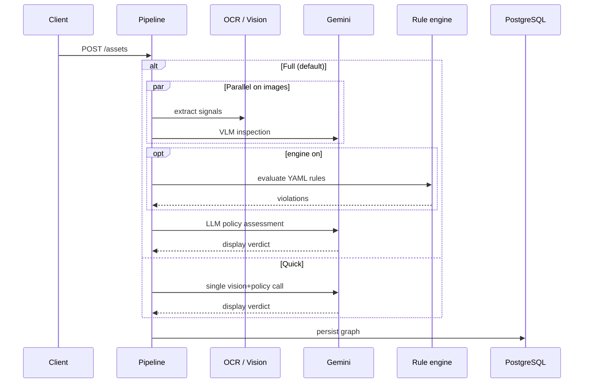

# ZataOne — Cofounder Platform Brief (1 page)

**Updated:** 2026-07-01 · Source: repo `main` (verified against code)

---

## What we are

**Evidence-first ad compliance platform** — ingest creative (text / image / video / audio), extract structured **signals**, compare against a **policy corpus**, return a **verdict + compliance graph** (signals, violations, evidence, audit trail) in PostgreSQL.

**Important — how it runs today (defaults):**

| Question | Answer |
|----------|--------|
| Deterministic-first? | **Yes (new default).** Engine + BM25 retrieval ON; ontology US pack is primary policy source. |
| Rule engine default | **`ZATAONE_POLICY_ENGINE_ENABLED=true`** → violations from ontology-derived rules. Set `=0` for Gemini-only path. |
| Policy pack default | **`ontology/corpus/*_us.yaml`** (~146 clauses, ~121 rules). Legacy: `ZATAONE_LEGACY_META_POLICY=1`. |
| Platform scope | **`platform=all`** (full US corpus). Per-request: `metadata.platform` or **`X-Platform: meta|google|tiktok|…`**. |
| Who owns the UI verdict? | **LLM synthesis** (signals + VLM + rule hits). Rule engine = audit evidence. |

Tagline in README (“deterministic, evidence-first”) describes the **design goal**, not the current default runtime.

---

## System (one glance)



**GCP:** project `zetaone-493600` · Cloud Run `zataone-api` · Cloud SQL PostgreSQL · UI `web/policylens.html`

---

## Pipeline flow



---

## Pipeline modes

| | **Full** (default) | **Quick** (`X-Pipeline-Mode: fast`) |
|--|-------------------|-------------------------------------|
| Extractors | OCR + Grounding DINO (default config) | Skipped |
| Rule engine | **On** (ontology rules) unless `ZATAONE_POLICY_ENGINE_ENABLED=0` | Off |
| Gemini | VLM ∥ extractors, then LLM vs policy | One combined vision+policy call |
| Display verdict | **Gemini** (engine off) | **Gemini** |

When **`ZATAONE_POLICY_ENGINE_ENABLED=1`**: rule engine produces violations + deterministic audit fields; **LLM sets display verdict** (default `ZATAONE_VERDICT_AUTHORITY=advisory`).

---

## Models & parameters (production path)

| Role | What runs | Notes |
|------|----------|-------|
| **OCR** | Tesseract | `min_confidence: 40`; always on for text-in-image |
| **Vision objects** | `IDEA-Research/grounding-dino-base` | **87** corpus-mined queries (`vision_queries.py`); threshold **0.3** |
| **VLM inspection** | **Gemini** (`GEMINI_VLM_MODEL` or default **`gemini-2.0-flash-001`**) | Parallel on images when `GEMINI_API_KEY` set |
| **Policy LLM** | **Gemini** (`GEMINI_MODEL` / `GEMINI_FAST_MODEL` / `GEMINI_REVIEW_MODEL`) | Primary assessor when engine off; temp **0.2** |
| **Embedding** | SigLIP `google/siglip-base-patch16-224` | **Off** unless `ZATAONE_ENABLE_EMBEDDING=1`; threshold **0.6** |
| **ASR** | faster-whisper **`base`** | Audio/video; `WHISPER_DEVICE=cpu`, `int8` |
| **GPT / OpenAI** | `gpt-4o` in config only | **Not used by default.** Legacy optional extractor: `ZATAONE_ENABLE_PIPELINE_VLM=1` + `VLM_API_KEY`. Production uses **Gemini**, not GPT. |

Config file: `src/zataone/domains/ad_compliance/configs/meta_ads_config.yaml`  
Docker preloads DINO + SigLIP; sets `ZATAONE_DISABLE_CORE_STUB_EXTRACTORS=true`.

---

## Verdict logic

**When engine off (default):** pre-advisory state is `PENDING_ADVISORY` → Gemini sets **`display_compliance_status`** / **`display_verdict`**.

**When engine on:** LLM **`recommended_*`** drives display; deterministic fields kept for audit (`deterministic_compliance_status`, violations graph).

**Risk score (engine path):** severity points CRITICAL=100, HIGH=50, MEDIUM=20, LOW=5 → non-compliant ≥ **70**, borderline ≥ **30**.

---

## Policy & knowledge

| Layer | Location | Scale |
|-------|----------|------:|
| Runtime policy pack | `ontology/corpus/*_us.yaml` (via `ontology_pack_builder`) | **~146** clauses · **~121** engine rules |
| Legacy fallback | `domains/ad_compliance/policies/meta_ads.yaml` | `ZATAONE_LEGACY_META_POLICY=1` |
| Ontology (moat) | `ontology/` | **157** clauses · **52** canonical · **614** eval · **128** precedents |
| Retrieval | BM25 shortlist | **On** by default (`ZATAONE_POLICY_RETRIEVAL=1`) |

---

## API (customer-facing)

`POST /assets` · `GET /assets/{id}` · `GET /assets/{id}/graph` · `POST /assets/{id}/llm-final-review` (optional extra advisory)

Headers: `X-Pipeline-Mode`, `X-Platform`, `X-Tenant-ID`, `X-Domain`, `Idempotency-Key`

---

## Key env vars

```
GEMINI_API_KEY / GOOGLE_API_KEY     # Required for verdict in default config
ZATAONE_PIPELINE_MODE=full|fast     # Default: full
ZATAONE_ONTOLOGY_PACK=1              # Default ON — load ontology US pack
ZATAONE_LEGACY_META_POLICY=1         # Force legacy meta_ads.yaml
ZATAONE_VERDICT_AUTHORITY=advisory   # Default — LLM final judge on Full
ZATAONE_VERDICT_AUTHORITY=deterministic  # Rule engine owns display again
ZATAONE_POLICY_ENGINE_ENABLED=1      # Default ON — rule hits for audit
ZATAONE_POLICY_RETRIEVAL=1           # Default ON — BM25 shortlist (top-K=8)
ZATAONE_DOCUMENT_CENTRIC=1           # Match on unified document text
ZATAONE_ENABLE_EMBEDDING=1           # SigLIP signals
ZATAONE_ENABLE_PIPELINE_VLM=1        # Legacy OpenAI extractor (not Gemini)
# Platform: metadata.platform or X-Platform: meta|google|tiktok|all
DATABASE_URL / CORS_ORIGINS
```

---

## Honest status & next decisions

**Working:** multimodal pipeline, graph API, PolicyLens, Cloud Run deploy, ontology-as-default policy pack, platform filter, corpus-mined DINO queries.

**Decide together:**
1. Tune ontology-derived engine rules vs full DSL migration per category.
2. Grow eval beyond 614 + pilot customer flywheel before quoting metrics.
3. Keep Quick mode for demos only vs customer-facing?
4. EU corpus + `X-Jurisdiction` expansion when needed.

---

*Print this page to PDF from your editor, or open in GitHub.*
