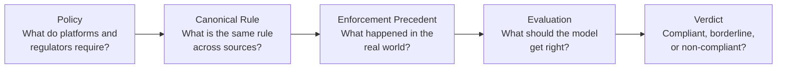
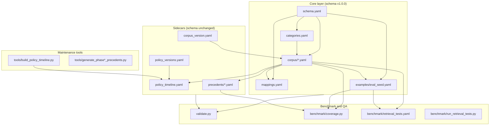
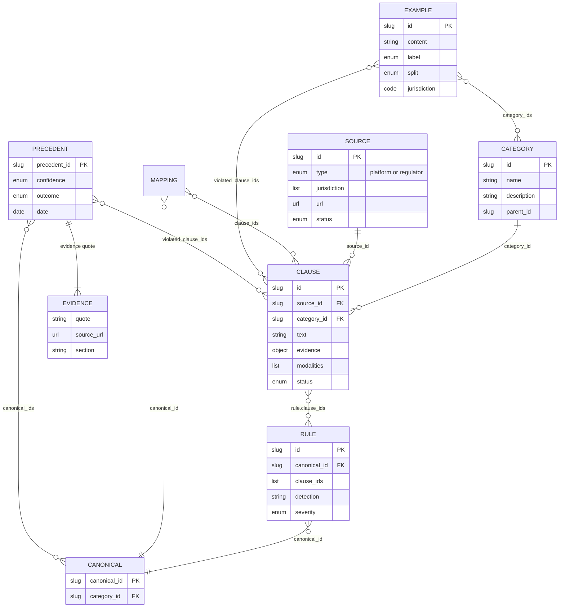
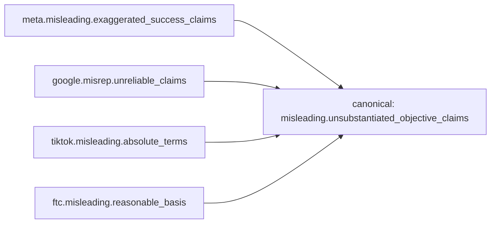
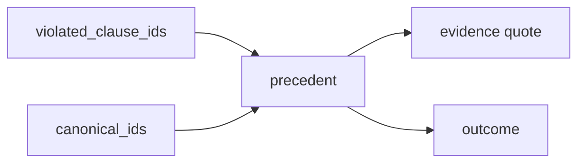
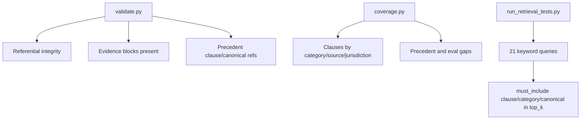
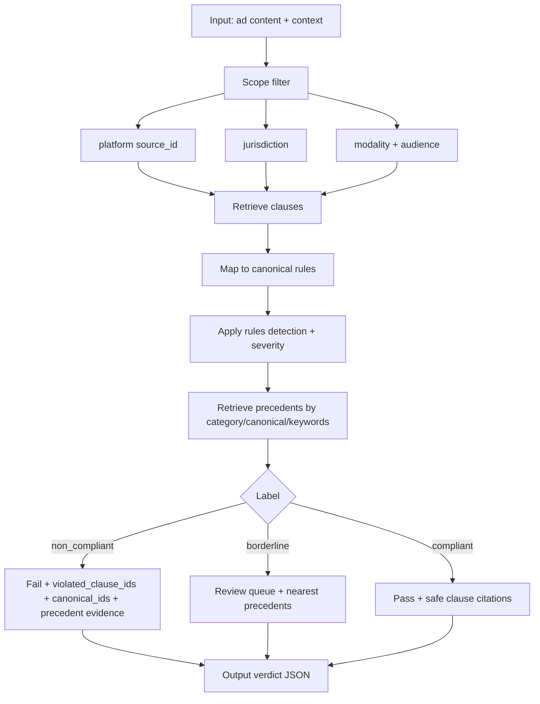

# ZetaOne Ontology — Architecture Map

**Canonical documentation for developers and AI agents.**

This document describes the current state of the advertising-compliance ontology in
`ontology/`. All counts were derived from the repository on **2026-06-27** via
`ontology/validate.py` and `ontology/benchmark/coverage.py`. Re-run those commands
after any corpus change to refresh statistics.

| Property | Value |
|----------|-------|
| Schema version | `1.0.0` (frozen — do not redesign) |
| Corpus release | **Ad Corpus v0.11** (`corpus_version.yaml`) |
| Validation status | OK |
| Retrieval tests | 21/21 passed |

---

## Architecture Principles

The ontology is intentionally split into five layers. Each layer answers a different
question and can evolve independently without breaking the frozen schema.



| Layer | Question | Primary artifacts |
|-------|----------|-------------------|
| **Policy** | What is the verbatim rule text? | `corpus/*.yaml` — clauses with evidence |
| **Canonical Rule** | Which clauses express the same obligation? | `mappings.yaml`, `rule.canonical_id` |
| **Precedent** | How was this enforced in practice? | `precedents/*.yaml` — cases + evidence |
| **Evaluation** | What labels ground truth metrics? | `examples/eval_seed.yaml` |
| **Verdict** | What is the compliance outcome? | Runtime output of the inference pipeline |

**Why this split matters:**

1. **Policy** stays traceable — every clause has a verbatim `evidence.quote` and
   official `source_url`. Nothing is invented.
2. **Canonical rules** collapse Meta, Google, FTC, etc. into one machine-checkable
   concept so retrieval and scoring work cross-platform.
3. **Precedents** connect abstract policy to real penalties, settlements, and
   platform enforcement — essential for explainability and risk ranking.
4. **Evaluation** is the benchmark contract — precision/recall are measured per
   `category_id` and per `canonical_id`, not per platform silo.
5. **Verdict** is the product output — a labeled decision backed by policy quotes
   and, when available, enforcement citations.

The moat is the **combination** of structured corpus + cross-source mappings +
labeled evaluation + enforcement precedents — not any single file.

---

## Overall Architecture



**Knowledge graph (runtime):**

```
Ad copy → retrieve clauses → lift to canonical rules → match precedents → verdict + evidence
```

---

## Knowledge Graph and Entity Relationships

Entities are defined in `schema.yaml`. Relationships:



| Entity | File(s) | Count (current) |
|--------|---------|-----------------|
| Category | `categories.yaml` | 14 defined, **11 with clauses** |
| Source | `corpus/*.yaml` | **25** |
| Clause | `corpus/*.yaml` | **157** |
| Rule | `corpus/*.yaml` | **128** |
| Mapping | `mappings.yaml` | **37** cross-source entries |
| Canonical rule (unique ids) | `mappings.yaml` + corpus rules | **52** |
| Example (seed) | `examples/eval_seed.yaml` | **570** |
| Example (precedent) | `examples/eval_precedents.yaml` | **44** |
| Example (total) | merged via `load_eval.py` | **614** |
| Precedent | `precedents/*.yaml` | **128** |

Categories **defined but without clauses yet:** `adult`, `restricted_products`.
Category `safety` is defined in `categories.yaml` but has no clauses; one precedent
tags `safety` secondarily.

---

## Corpus Structure

### Release manifest

`corpus_version.yaml` tracks frozen vertical releases **v0.1 → v0.11**:

| Version | Milestone |
|---------|-----------|
| v0.1 | Misleading vertical frozen |
| v0.2 | + Health |
| v0.3 | + Financial |
| v0.4 | + Discrimination (housing/employment/credit) |
| v0.5 | + Political |
| v0.6 | + Minors |
| v0.7 | + Privacy |
| v0.8 | + Alcohol / Drugs (tobacco/cannabis) |
| v0.9 | + Gambling |
| v0.10 | + IP / Trademark |
| **v0.11** | +6 US platform starters, EU/UK/CA/AU starters, benchmark suite, precedents sidecar, policy timeline |

**Current release:** `Ad Corpus v0.11`

### Sources (25)

**Platform sources (12):**

| Source ID | Clauses | Depth |
|-----------|--------:|-------|
| `meta_ads_us` | 30 | Full US verticals |
| `google_ads_us` | 40 | Full US verticals |
| `tiktok_ads_us` | 27 | Full US verticals |
| `linkedin_ads_us` | 7 | Full US verticals |
| `x_ads_us` | 3 | Misleading starter |
| `amazon_ads_us` | 3 | Misleading starter |
| `snapchat_ads_us` | 2 | Misleading starter |
| `pinterest_ads_us` | 2 | Misleading starter |
| `reddit_ads_us` | 2 | Misleading starter |
| `microsoft_ads_us` | 2 | Misleading starter |
| `meta_ads_eu` | 2 | Misleading starter |
| `google_ads_eu` | 2 | Misleading starter |

**Regulator / jurisdiction sources (13):**

| Source ID | Clauses | Jurisdiction |
|-----------|--------:|--------------|
| `ftc_us` | 8 | US |
| `fda_us` | 5 | US |
| `sec_us` | 3 | US |
| `finra_us` | 2 | US |
| `cfpb_us` | 3 | US |
| `hud_us` | 1 | US |
| `eeoc_us` | 2 | US |
| `fec_us` | 1 | US |
| `ccpa_ca` | 2 | US (CA law) |
| `ttb_us` | 1 | US |
| `asa_uk` | 3 | UK |
| `competition_bureau_ca` | 2 | CA |
| `accc_au` | 2 | AU |

### Clauses by category

| Category | Clauses | Eval examples | Precedents |
|----------|--------:|--------------:|-----------:|
| misleading | 45 | 27 | 86 |
| financial | 28 | 60 | 46 |
| health | 23 | 60 | 20 |
| discrimination | 11 | 60 | 7 |
| gambling | 10 | 60 | 12 |
| drugs | 9 | 34 | 9 |
| minors | 8 | 60 | 11 |
| ip_trademark | 7 | 60 | 10 |
| political | 7 | 60 | 15 |
| privacy | 6 | 60 | 10 |
| alcohol | 3 | 26 | 3 |

### Clauses by jurisdiction

| Jurisdiction | Clauses |
|--------------|--------:|
| US | 146 |
| EU | 4 |
| UK | 3 |
| CA | 2 |
| AU | 2 |

### Clause shape (every clause)

Each clause in `corpus/*.yaml` includes:

- `id`, `source_id`, `category_id`, `text`, `modalities`, `jurisdiction`
- `effective_date`, `version`, `status`, `last_verified_at`, `last_reviewed_by`
- **`evidence`**: `{ quote, source_url, section, retrieved_at }` — verbatim audit trail
- Optional `applicability` (countries, audience, industries)

Companion **`rules[]`** entries provide machine-checkable `detection` intent, `severity`,
`priority`, and `canonical_id` for automated checking.

---

## Canonical Mappings

`mappings.yaml` links equivalent clauses across sources into shared **`canonical_id`**
values within a category.



| Metric | Count |
|--------|------:|
| Total unique canonical rules | **52** |
| Cross-source mappings (`mappings.yaml` entries) | **37** |
| Single-source canonicals (honestly unmapped) | **15** |

**Single-source canonicals** (no second official source mapped yet):

- `atc.alcohol_mandatory_and_prohibited_statements`
- `atc.tobacco_advertising_format_restrictions`
- `finance.mortgage_advertising_prohibited_acts`
- `finance.testimonials_endorsements_disclosure`
- `health.health_privacy_sensitive_attributes`
- `health.material_risk_safety_disclosure`
- `health.negative_self_perception_body_image`
- `health.rx_fair_balance_risk_disclosure`
- `ip.unauthorized_copyrighted_works_prohibited`
- `minors.child_directed_content_ad_restrictions`
- `minors.parental_consent_for_childrens_data`
- `political.synthetic_content_disclosure`
- `privacy.data_collection_disclosure_required`
- `privacy.minor_opt_in_for_sale_or_sharing`
- `privacy.opt_out_of_sale_or_sharing_for_targeted_ads`

Mapping fields: `canonical_id`, `category_id`, `clause_ids[]`, `relation`
(`equivalent` | `stricter` | `broader` | `related`), `confidence`, optional `note`.

---

## Evaluation Dataset

**Files:**

| File | Role | Count |
|------|------|------:|
| `examples/eval_seed.yaml` | Synthetic seed (balanced labels) | **570** |
| `examples/eval_precedents.yaml` | Real-world rows from enforcement precedents | **44** |
| **Total** (merged by `load_eval.py`) | | **614** |

### Seed set (`eval_seed.yaml`)

| Metric | Value |
|--------|------:|
| Total examples | **570** |
| Labels | 190 `compliant`, 190 `non_compliant`, 190 `borderline` |
| Splits | 77 `train`, 342 `dev`, 151 `test` |
| Default modality | `text` |
| Default jurisdiction | `US` |
| `labeled_by` | `expert` (seed authoring) |

### Precedent-derived set (`eval_precedents.yaml`)

| Metric | Value |
|--------|------:|
| Total examples | **44** |
| Label | all `non_compliant` |
| Split | all `test` (real-world holdout) |
| Provenance | `note: derived_from: prec.*` |
| Regenerate | `python ontology/tools/build_eval_precedents.py` |

**Examples per vertical** (seed only — from file header and coverage):

| Vertical | Examples | Balance |
|----------|--------:|---------|
| Misleading | 30 | 10 / 10 / 10 |
| Health | 60 | 20 / 20 / 20 |
| Financial | 60 | 20 / 20 / 20 |
| Discrimination (housing/employment) | 60 | 20 / 20 / 20 |
| Political | 60 | 20 / 20 / 20 |
| Minors | 60 | 20 / 20 / 20 |
| Privacy | 60 | 20 / 20 / 20 |
| Alcohol / Tobacco / Cannabis | 60 | 20 / 20 / 20 (tagged `alcohol` + `drugs`) |
| Gambling | 60 | 20 / 20 / 20 |
| IP / Counterfeit | 60 | 20 / 20 / 20 |

Each example conforms to `entities.example` in `schema.yaml`:

- `id`, `content`, `modality`, `label`, `category_ids[]`
- `violated_clause_ids[]` (empty when compliant)
- `jurisdiction`, `labeled_by`, `split`

**Benchmark use:** compute precision/recall per `category_id` and per `canonical_id`
by retrieving clauses for each example and comparing to ground-truth
`violated_clause_ids`.

---

## Precedent Layer

**Directory:** `precedents/` — sidecar on top of frozen schema (128 verified US cases).



**Status:** US precedent layer **complete** at 128 entries (target was 120–150).
All entries have `confidence: verified`, verbatim evidence, and official `source_url`.

### Precedents by file

| File | Count |
|------|------:|
| `platforms.yaml` | 19 |
| `ftc_expansion.yaml` | 14 |
| `cfpb.yaml` | 10 |
| `ftc.yaml` | 10 |
| `fec.yaml` | 9 |
| `state_ag.yaml` | 8 |
| `doj.yaml` | 8 |
| `ftc_phase3.yaml` | 7 |
| `fda_expansion.yaml` | 5 |
| `finra.yaml` | 5 |
| `gambling.yaml` | 5 |
| `sec_expansion.yaml` | 5 |
| `sec_phase3.yaml` | 5 |
| `precedents.yaml` | 6 |
| `sec.yaml` | 4 |
| `ttb.yaml` | 3 |
| `fda.yaml` | 2 |
| `eeoc_hud.yaml` | 2 |
| `hud_expansion.yaml` | 1 |
| **Total** | **128** |

### Precedents by enforcing body (prefix)

| Prefix | Count |
|--------|------:|
| `ftc` | 34 |
| `sec` | 15 |
| `cfpb` | 10 |
| `fec` | 10 |
| `fda` | 7 |
| `doj` | 7 |
| `nyag` | 6 |
| `meta` | 6 |
| `njdge` | 5 |
| `finra` | 5 |
| `google` | 5 |
| `tiktok` | 3 |
| `ttb` | 3 |
| `caag` | 2 |
| `doj_hud` | 2 |
| `linkedin` | 2 |
| `amazon` | 2 |
| `hud` | 2 |
| `x` | 1 |
| `eeoc_meta_age_discrimination_2023` | 1 |

### Precedents by outcome

| Outcome | Count |
|---------|------:|
| settlement | 41 |
| consent_order | 20 |
| guidance | 18 |
| fine | 12 |
| court_order | 11 |
| civil_penalty | 7 |
| warning_letter | 7 |
| suspension | 5 |
| injunction | 3 |
| no_action | 3 |
| marketing_denial | 1 |

See `precedents/README.md` for entry field reference and maintenance standards.

---

## Benchmark and Validation Layer



| Tool | Purpose | Current result |
|------|---------|----------------|
| `validate.py` | Schema + referential integrity for corpus, eval, precedents, sidecars | **OK** |
| `coverage.py` | Stats and gap report (human or `--json`) | 157 clauses, 128 precedents, 614 evals |
| `run_retrieval_tests.py` | Keyword retrieval baseline against corpus | **21/21 passed** |
| `retrieval_tests.yaml` | Test definitions (query + required hits) | 21 tests |
| `build_policy_timeline.py` | Regenerate `policy_timeline.yaml` from corpus + `policy_versions.yaml` | Manual |

### Commands

Use the conda Python environment (PyYAML required):

```bash
# Referential integrity — run before every commit touching ontology/
/Users/sal/anaconda3/bin/python ontology/validate.py

# Coverage report (human-readable)
/Users/sal/anaconda3/bin/python ontology/benchmark/coverage.py

# Coverage report (JSON for agents/automation)
/Users/sal/anaconda3/bin/python ontology/benchmark/coverage.py --json

# Keyword retrieval benchmark
/Users/sal/anaconda3/bin/python ontology/benchmark/run_retrieval_tests.py

# Regenerate policy timeline sidecar
/Users/sal/anaconda3/bin/python ontology/tools/build_policy_timeline.py
```

---

## Runtime Inference Pipeline

How a compliance check should flow in production (not yet fully implemented as a
single service — this is the target architecture):



**Input context fields:**

- `content` — ad copy or landing-page text
- `platform` — e.g. `meta_ads_us`
- `jurisdiction` — e.g. `US`
- `modality` — `text`, `image`, `video`, `audio`, `landing_page`
- `audience` — optional age gating

**Output verdict fields (target):**

- `label` — `compliant` | `non_compliant` | `borderline`
- `violated_clause_ids[]`, `canonical_ids[]`
- `precedent_ids[]` with `evidence` quotes
- `policy_evidence[]` — clause quotes from corpus
- `severity`, `recommended_actions`

---

## Repository and File Tree

```
ontology/
├── ONTOLOGY_MAP.md          ← this document (canonical architecture reference)
├── README.md                ← quick-start and entity overview
├── schema.yaml              ← FROZEN entity definitions and enums (v1.0.0)
├── categories.yaml          ← 14 universal risk categories
├── mappings.yaml            ← 37 cross-source canonical mappings
├── corpus_version.yaml      ← Ad Corpus v0.1–v0.11 release manifest
├── validate.py              ← integrity validator (run before commit)
│
├── corpus/                  ← 157 clauses, 25 sources, 128 rules
│   ├── meta_ads_us.yaml     # Meta Ads US — deepest platform corpus
│   ├── google_ads_us.yaml   # Google Ads US
│   ├── tiktok_ads_us.yaml   # TikTok Ads US
│   ├── linkedin_ads_us.yaml # LinkedIn Ads US
│   ├── x_ads_us.yaml        # X Ads US — misleading starter
│   ├── amazon_ads_us.yaml   # Amazon Ads US — misleading starter
│   ├── snapchat_ads_us.yaml # Snapchat Ads US — misleading starter
│   ├── pinterest_ads_us.yaml
│   ├── reddit_ads_us.yaml
│   ├── microsoft_ads_us.yaml
│   ├── meta_ads_eu.yaml     # Meta Ads EU — misleading starter
│   ├── google_ads_eu.yaml   # Google Ads EU — misleading starter
│   ├── regulators_us.yaml   # FTC FDA SEC FINRA CFPB HUD EEOC FEC CCPA TTB
│   ├── regulators_uk.yaml   # ASA / CAP Code starter
│   ├── regulators_ca.yaml   # Competition Bureau starter
│   └── regulators_au.yaml   # ACCC / ACL starter
│
├── precedents/              ← 128 verified enforcement cases (sidecar)
│   ├── README.md            # Precedent layer standards and file index
│   ├── precedents.yaml      # Seed cases (COPPA, fair housing, Kardashian, Teami)
│   ├── ftc.yaml             # FTC seed enforcement
│   ├── ftc_expansion.yaml   # Phase 1 FTC expansion
│   ├── ftc_phase3.yaml      # Phase 3 FTC expansion
│   ├── sec.yaml             # SEC seed
│   ├── sec_expansion.yaml   # Phase 1 SEC crypto/influencer
│   ├── sec_phase3.yaml      # Phase 3 SEC (Terraform, Kraken, NFTs)
│   ├── cfpb.yaml            # CFPB enforcement
│   ├── finra.yaml           # FINRA finfluencer discipline
│   ├── fec.yaml             # FEC political ad disclosure
│   ├── state_ag.yaml        # NY/CA Attorney General actions
│   ├── doj.yaml             # DOJ IP/counterfeit (non-HUD)
│   ├── platforms.yaml       # Meta/Google/TikTok/LinkedIn/Amazon/X policy enforcement
│   ├── gambling.yaml        # NJ DGE sportsbook penalties
│   ├── ttb.yaml             # TTB alcohol trade practices
│   ├── fda.yaml             # FDA seed
│   ├── fda_expansion.yaml   # FDA tobacco/ENDS/cannabis expansion
│   ├── eeoc_hud.yaml        # EEOC + HUD seed
│   └── hud_expansion.yaml   # HUD Facebook housing charge
│
├── examples/
│   ├── eval_seed.yaml       ← 570 synthetic seed eval examples
│   ├── eval_precedents.yaml ← 44 precedent-derived eval (test holdout)
│   └── load_eval.py         ← merges seed + precedent eval for validate/coverage
│
├── policy_versions.yaml     ← 11 policy metadata entries (version/effective/status)
├── policy_timeline.yaml     ← 157 per-clause lifecycle events
│
├── benchmark/
│   ├── README.md            # Benchmark command reference
│   ├── coverage.py          # Coverage and gap statistics
│   ├── retrieval_tests.yaml # 21 retrieval test cases
│   └── run_retrieval_tests.py
│
└── tools/
    ├── build_policy_timeline.py
    ├── backfill_precedent_metadata.py
    ├── generate_phase1_precedents.py
    ├── generate_phase2_precedents.py
    ├── generate_phase3_precedents.py
    └── build_eval_precedents.py
```

### Purpose of each major artifact

| Path | Purpose |
|------|---------|
| `schema.yaml` | Defines entities, fields, enums, and graph relationships. **Frozen.** |
| `categories.yaml` | Universal risk axes every clause and example maps to. |
| `corpus/*.yaml` | Verbatim platform and regulator policy clauses + rules. |
| `mappings.yaml` | Cross-source canonical rule links. |
| `corpus_version.yaml` | Versioned release history and eval counts per vertical. |
| `policy_versions.yaml` | Official policy version/effective/status metadata per source. |
| `policy_timeline.yaml` | Per-clause introduced/modified/deprecated event log. |
| `precedents/*.yaml` | Real-world enforcement linking policy to outcomes. |
| `examples/eval_seed.yaml` | Ground-truth labeled ads for benchmarking. |
| `validate.py` | Gate: all references must resolve; evidence required. |
| `benchmark/` | Coverage stats and retrieval regression tests. |
| `tools/` | Generators and maintenance scripts (precedents, timeline). |

---

## Current Corpus Statistics (snapshot)

Derived from `validate.py` + `coverage.py --json` on 2026-06-27:

| Metric | Value |
|--------|------:|
| Schema version | 1.0.0 |
| Corpus release | Ad Corpus v0.11 |
| Categories defined | 14 |
| Categories with clauses | 11 |
| Sources | 25 |
| Platform sources | 12 |
| Regulator sources | 13 |
| Clauses | 157 |
| Rules | 128 |
| Canonical rules (unique) | 52 |
| Cross-source canonicals | 37 |
| Single-source canonicals | 15 |
| Eval examples | 614 (570 seed + 44 precedent-derived) |
| Precedents | 128 |
| Policy version entries | 11 |
| Policy timeline entries | 157 |
| Retrieval tests | 21 (all passing) |

**Coverage gaps (current):**

- Categories without clauses: `adult`, `restricted_products`
- Categories without precedents: `adult`, `restricted_products` (plus `safety` has no clauses)
- All 11 clause-bearing categories have at least one precedent
- International sources are **starters only** (EU/UK/CA/AU); US is production depth

---

## Future Roadmap

Ordered by current project priority after completing the US precedent layer (128 cases):

1. **Large-scale evaluation dataset (10k–100k+ examples)** — expand beyond 614 (570 seed + 44 precedent-derived)
   examples; add multimodal (image/video) items; inter-annotator agreement before
   external metrics.
2. **Embedding + retrieval benchmarks** — complement the 21-test keyword baseline
   with vector retrieval; measure MRR/recall@k per category and canonical.
3. **Pilot customer integration** — wire the inference pipeline to real ad-review
   workflows; collect production false-positive/negative feedback into eval splits.
4. **Continuous policy updates** — automate diff detection against official sources;
   refresh `policy_versions.yaml` and `policy_timeline.yaml` on policy changes.
5. **International expansion** — deepen EU/UK/CA/AU corpus beyond starters; add
   international precedents only after US eval baseline is stable.
6. **Automated precedent ingestion** — official-source scrapers + human verification
   queue for new enforcement actions (FTC, SEC, state AGs, platforms).
7. **Human review workflow** — upgrade `last_reviewed_by: ai` clauses to human-verified;
   expert review queue for borderline eval labels and new precedents.

---

## Machine-Readable Summary (for AI agents)

Paste this block as system context. Regenerate counts with the commands in
[Benchmark and Validation Layer](#benchmark-and-validation-layer).

```yaml
# ZetaOne Ontology — machine-readable map
# Generated: 2026-07-01
# Canonical doc: ontology/ONTOLOGY_MAP.md

project: ZetaOne
ontology_path: ontology/
schema_version: "1.0.0"          # FROZEN — do not redesign
corpus_version: "Ad Corpus v0.11"
validation_status: OK
retrieval_tests: { total: 21, passed: 21, failed: 0 }

counts:
  categories_defined: 14
  categories_with_clauses: 11
  sources: 25
  platform_sources: 12
  regulator_sources: 13
  clauses: 157
  rules: 128
  canonical_rules_unique: 52
  canonical_cross_source: 37
  canonical_single_source: 15
  mapping_entries: 37
  eval_examples: 614
  eval_seed: 570
  eval_precedents: 44
  eval_labels: { compliant: 190, non_compliant: 234, borderline: 190 }
  eval_splits: { train: 77, dev: 342, test: 195 }
  precedents: 128
  precedent_confidence: verified
  policy_version_entries: 11
  policy_timeline_entries: 157

categories_with_clauses:
  - misleading      # 45 clauses, 27 evals, 86 precedents
  - financial       # 28 clauses, 60 evals, 46 precedents
  - health          # 23 clauses, 60 evals, 20 precedents
  - discrimination  # 11 clauses, 60 evals, 7 precedents
  - gambling        # 10 clauses, 60 evals, 12 precedents
  - drugs           # 9 clauses, 34 evals, 9 precedents
  - minors          # 8 clauses, 60 evals, 11 precedents
  - ip_trademark    # 7 clauses, 60 evals, 10 precedents
  - political       # 7 clauses, 60 evals, 15 precedents
  - privacy         # 6 clauses, 60 evals, 10 precedents
  - alcohol         # 3 clauses, 26 evals, 3 precedents

categories_defined_no_clauses_yet:
  - adult
  - restricted_products

jurisdiction_clause_counts:
  US: 146
  EU: 4
  UK: 3
  CA: 2
  AU: 2

platform_source_ids:
  - meta_ads_us
  - google_ads_us
  - tiktok_ads_us
  - linkedin_ads_us
  - x_ads_us
  - amazon_ads_us
  - snapchat_ads_us
  - pinterest_ads_us
  - reddit_ads_us
  - microsoft_ads_us
  - meta_ads_eu
  - google_ads_eu

regulator_source_ids:
  - ftc_us
  - fda_us
  - sec_us
  - finra_us
  - cfpb_us
  - hud_us
  - eeoc_us
  - fec_us
  - ccpa_ca
  - ttb_us
  - asa_uk
  - competition_bureau_ca
  - accc_au

entity_graph:
  - "category 1..* clause"
  - "source 1..* clause"
  - "clause *..* rule via rule.clause_ids"
  - "rule *..1 canonical_id"
  - "mapping links clause<->clause via canonical_id"
  - "example *..* clause via violated_clause_ids"
  - "precedent *..* clause and canonical_ids via evidence[]"

architecture_layers:
  - policy      # corpus/*.yaml clauses
  - canonical   # mappings.yaml + rule.canonical_id
  - precedent   # precedents/*.yaml
  - evaluation  # examples/eval_seed.yaml
  - verdict     # runtime pipeline output

key_files:
  schema: ontology/schema.yaml
  categories: ontology/categories.yaml
  corpus_glob: ontology/corpus/*.yaml
  mappings: ontology/mappings.yaml
  eval: ontology/examples/eval_seed.yaml
  precedents_glob: ontology/precedents/*.yaml
  corpus_version: ontology/corpus_version.yaml
  policy_versions: ontology/policy_versions.yaml
  policy_timeline: ontology/policy_timeline.yaml
  validator: ontology/validate.py
  coverage: ontology/benchmark/coverage.py
  retrieval_tests: ontology/benchmark/retrieval_tests.yaml

commands:
  validate: "/Users/sal/anaconda3/bin/python ontology/validate.py"
  coverage: "/Users/sal/anaconda3/bin/python ontology/benchmark/coverage.py"
  coverage_json: "/Users/sal/anaconda3/bin/python ontology/benchmark/coverage.py --json"
  retrieval: "/Users/sal/anaconda3/bin/python ontology/benchmark/run_retrieval_tests.py"
  rebuild_timeline: "/Users/sal/anaconda3/bin/python ontology/tools/build_policy_timeline.py"

pipeline:
  input: [content, platform, jurisdiction, modality, audience]
  steps: [scope_filter, retrieve_clauses, map_canonicals, apply_rules, retrieve_precedents, label_verdict]
  output: [label, violated_clause_ids, canonical_ids, precedent_ids, policy_evidence, precedent_evidence]

roadmap_priority:
  - large_eval_dataset_10k_100k
  - embedding_retrieval_benchmarks
  - pilot_customer_integration
  - continuous_policy_updates
  - international_expansion
  - automated_precedent_ingestion
  - human_review_workflow
```

---

## Related Documentation

- `ontology/README.md` — quick-start, entity diagram, vertical freeze history
- `ontology/precedents/README.md` — precedent entry schema and file index
- `ontology/benchmark/README.md` — benchmark command reference
- `ontology/corpus_version.yaml` — full v0.1–v0.11 release notes
