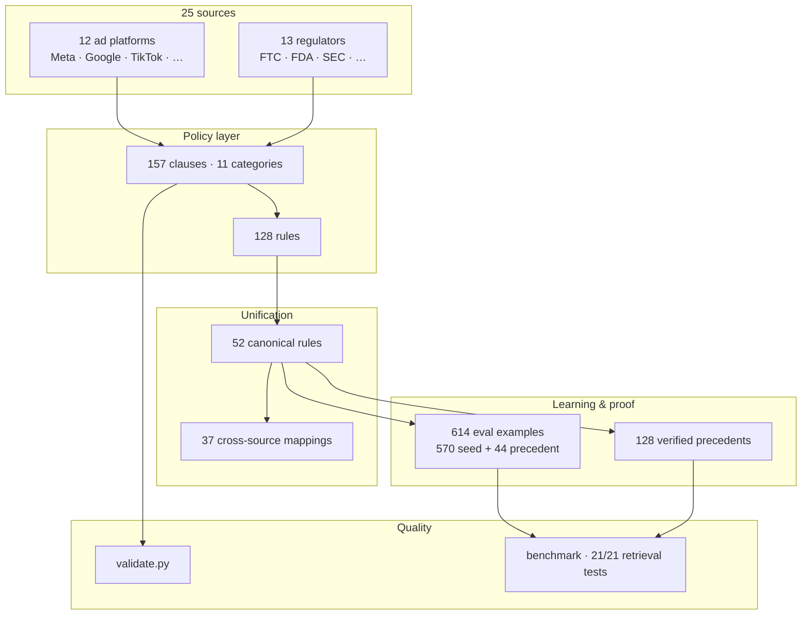

# ZataOne Canonical Compliance Ontology

**Architecture reference:** see [`ONTOLOGY_MAP.md`](ONTOLOGY_MAP.md) for the
canonical system map (entities, stats, pipeline, commands, AI-agent summary).

One unified corpus where every **platform** (Meta, Google, TikTok, …) and
**regulator** (FTC, FDA, …) policy maps into the **same underlying ontology**.
This is the foundation for ZataOne's moat: structured corpus + cross-source
mappings + a labeled evaluation dataset with measured precision/recall.

## Corpus at a glance



**Flow:** platform + regulator policies → clauses & rules → shared canonical
rules → mappings, labeled evals, and enforcement precedents → validation &
benchmarks. Full detail: [`ONTOLOGY_MAP.md`](ONTOLOGY_MAP.md).

## Files

| File | Purpose |
|------|---------|
| `schema.yaml` | **Canonical schema v0** — entities, fields, allowed values, graph |
| `categories.yaml` | Universal advertising-risk categories (the foundation axis) |
| `corpus/meta_ads_us.yaml` | Meta Ads (US) — Misleading + Health + Financial + Discrimination + Political clauses + rules |
| `corpus/google_ads_us.yaml` | Google Ads (US) — Misrepresentation + Healthcare/Medicines + Financial + Discrimination + Political clauses + rules |
| `corpus/tiktok_ads_us.yaml` | TikTok Ads (US) — Misleading & false content + Healthcare/Pharmaceuticals + Financial + Discrimination + Political |
| `corpus/linkedin_ads_us.yaml` | LinkedIn Ads (US) — Financial + Discrimination + Political clauses + rules |
| `corpus/x_ads_us.yaml` | X Ads (US) — Misleading starter |
| `corpus/amazon_ads_us.yaml` | Amazon Ads (US) — Misleading starter |
| `corpus/snapchat_ads_us.yaml` | Snapchat Ads (US) — Misleading starter |
| `corpus/pinterest_ads_us.yaml` | Pinterest Ads (US) — Misleading starter |
| `corpus/reddit_ads_us.yaml` | Reddit Ads (US) — Misleading starter |
| `corpus/microsoft_ads_us.yaml` | Microsoft Advertising (US) — Misleading starter |
| `corpus/meta_ads_eu.yaml` | Meta Ads (EU) — Misleading starter |
| `corpus/google_ads_eu.yaml` | Google Ads (EU) — Misrepresentation starter |
| `corpus/regulators_uk.yaml` | ASA / CAP Code (UK) — Misleading starter |
| `corpus/regulators_ca.yaml` | Competition Bureau (CA) — Misleading starter |
| `corpus/regulators_au.yaml` | ACCC / ACL (AU) — Misleading starter |
| `corpus/regulators_us.yaml` | FTC + FDA + SEC + FINRA + CFPB + HUD + EEOC + FEC + CCPA/CPRA + TTB (US) clauses + rules (Misleading + Health + Financial + Housing/Employment + Political + Minors/COPPA + Privacy + Alcohol/Tobacco) |
| `mappings.yaml` | Cross-source links: equivalent clauses → one `canonical_id` |
| `patterns/` | **Phase A hybrid packs** — hierarchical regex/terms/exceptions by `canonical_id` (US corpus mined) |
| `patterns/by_category/*.yaml` | Pattern packs per category (52 canonical → 11 files) |
| `tools/mine_pattern_candidates.py` | Regenerate pattern packs from full US corpus + eval |
| `examples/eval_seed.yaml` | Labeled evaluation dataset — **570 synthetic seed** examples (30 misleading + 60 per vertical × 9) |
| `examples/eval_precedents.yaml` | **44 real-world** eval rows derived from verified enforcement precedents (all `non_compliant`, `test` split) |
| `examples/load_eval.py` | Loader merging seed + precedent eval files for validate/coverage |
| `tools/build_eval_precedents.py` | Regenerate `eval_precedents.yaml` from curated precedent list |
| `corpus_version.yaml` | Frozen, versioned corpus releases (Ad Corpus v0.1 … v0.11) |
| `precedents/` | Phase 2 enforcement-precedent layer (Policy → Canonical Rule → Precedent → Evidence → Verdict) |
| `policy_timeline.yaml` | Per-clause policy diff timeline: introduced / modified / deprecated + official change history |
| `policy_versions.yaml` | Sidecar policy-metadata registry: per-source version / effective / last-updated / deprecated-superseded status / officially published change history (not part of the frozen schema) |
| `benchmark/` | Retrieval tests + coverage statistics (`coverage.py`, `retrieval_tests.yaml`) |
| `tools/build_policy_timeline.py` | Regenerate `policy_timeline.yaml` from corpus + `policy_versions.yaml` |
| `validate.py` | Validator: parse + referential integrity + evidence/applicability + sidecars |

## Entities

```
category ─< clause >── source
   │           │
   └─< rule >──┘   (rule.canonical_id unifies equivalent rules across sources)
        │
   mapping (clause ↔ clause, same category/canonical_id)
        │
   example >── clause   (eval dataset; label + violated_clause_ids)
```

## Schema highlights (v0)

- **`canonical_id` on rules** — equivalent platform/regulator rules share one universal rule.
- **`priority`** — resolves conflicts when multiple clauses apply (regulator usually outranks platform).
- **`modality`** on clauses/rules — `text · image · video · audio · landing_page`.
- **`status`** (`active · deprecated · superseded`) + **`superseded_by`** — policies change; history is auditable.
- **`last_verified_at`** on sources/clauses — "when did we last confirm this is current?".
- **`confidence`** on mappings (`exact · high · medium`) — not every mapping is perfectly equivalent.
- **`evidence`** on every clause (`quote · source_url · section · retrieved_at`) — full legal/audit trail.
- **`last_reviewed_by`** (`human · ai`) — `ai` until a person manually verifies the clause on the live page.
- **`applicability`** (optional: `countries · audience · industries`) — powers scoped retrieval later (e.g. "US health ad for 18+"). `audience` ∈ `all · 18+ · 21+ · 25+`; `industries` are category ids (`[all]` = cross-industry).

> Schema is **FROZEN** at v1.0.0. Effort now goes into expanding the corpus, the
> eval dataset, and benchmarking — not redesigning the ontology.

## Scope so far

- **Categories:** `misleading` (deep), `health` (deep), `financial` (deep), `discrimination` (Housing/Employment, deep), `political` (deep), `minors` (Children / Minors, deep), `privacy` (deep), `alcohol` (deep), `drugs` (Tobacco/Nicotine/Cannabis, deep), `gambling` (deep), `ip_trademark` (IP / Counterfeit, deep)
- **Sources:** Meta Ads, Google Ads, TikTok Ads, LinkedIn Ads, FTC, FDA, SEC, FINRA, CFPB, HUD, EEOC, FEC, CCPA/CPRA, TTB
- **Jurisdiction:** US
- **Current corpus version:** `Ad Corpus v0.11` (see `corpus_version.yaml`)
- **Sources:** 25 (12 platforms + 13 regulators) across US, EU, UK, CA, AU

### Misleading / Deceptive — canonical rules (vertical 1)

All platform/regulator clauses for this vertical collapse into these `canonical_id`s:

| `canonical_id` | Sources mapped |
|----------------|----------------|
| `misleading.exaggerated_results` | Meta, Google |
| `misleading.guaranteed_outcomes` | Meta, TikTok |
| `misleading.unsubstantiated_objective_claims` | FTC (backbone), TikTok |
| `misleading.missing_or_inconsistent_material_info` | Google, TikTok |
| `misleading.false_affiliation_or_endorsement` | Meta, Google |
| `misleading.clickbait_or_fake_ui` | Google |
| `misleading.before_after_distortion` | Meta, Google, TikTok |

FTC carries higher `priority` than platform rules on conflict.

### Health / Medical — canonical rules (vertical 2)

| `canonical_id` | Sources mapped |
|----------------|----------------|
| `health.disease_cure_treatment_claims` | Meta, Google, FTC, FDA |
| `health.unsubstantiated_health_claims` | FTC, FDA, Google |
| `health.prescription_drug_promotion_restricted` | Google, TikTok |
| `health.unapproved_or_dangerous_products` | Google, TikTok |
| `health.negative_self_perception_body_image` | Meta (only — no cross-source map yet) |
| `health.rx_fair_balance_risk_disclosure` | FDA (only — no cross-source map yet) |
| `health.health_privacy_sensitive_attributes` | Meta (only — no cross-source map yet) |
| `health.material_risk_safety_disclosure` | FTC (only — no cross-source map yet) |

FTC/FDA carry higher `priority` (95) than platform rules on conflict. Single-source
canonicals have no `mapping` entry yet — they get one once a second source matches.

### Financial services & investments — canonical rules (vertical 3)

| `canonical_id` | Sources mapped |
|----------------|----------------|
| `finance.prohibited_predatory_products` | Meta, Google, TikTok, LinkedIn |
| `finance.guaranteed_returns_or_risk_free` | TikTok, LinkedIn, FINRA, FTC |
| `finance.misleading_or_unbalanced_claims` | LinkedIn, FINRA, SEC |
| `finance.performance_claims_substantiation` | FINRA, SEC, FTC |
| `finance.required_cost_and_risk_disclosures` | Google, CFPB, TikTok, Meta |
| `finance.credit_advertising_trigger_terms` | CFPB, Google |
| `finance.licensing_registration_required` | Meta, Google, TikTok, LinkedIn |
| `finance.crypto_restricted` | Meta, Google, TikTok |
| `finance.loan_modification_foreclosure_restricted` | Google, LinkedIn, CFPB |
| `finance.mortgage_advertising_prohibited_acts` | CFPB (only — no cross-source map yet) |
| `finance.testimonials_endorsements_disclosure` | SEC (only — no cross-source map yet) |

SEC / FINRA / FTC / CFPB carry higher `priority` (90–95) than platform rules on
conflict. Two canonicals are intentionally single-source and kept honest until a
second official source genuinely matches.

Financial sources: Meta Ad Standards (Prohibited Financial Products, Cryptocurrency,
Financial & Insurance Services), Google Financial products and services, TikTok
Financial Services (US market section), LinkedIn Advertising Policies (Financial
Services), FTC (Penalty Offenses re money-making opportunities + 16 CFR 437.4), SEC
Marketing Rule (17 CFR 275.206(4)-1), FINRA Rule 2210, CFPB Reg Z / TILA (12 CFR
1026.24). Jurisdiction: US only.

### Housing & Employment — canonical rules (vertical 4, category `discrimination`)

| `canonical_id` | Sources mapped |
|----------------|----------------|
| `discrimination.discriminatory_ad_content_prohibited` | Meta, TikTok, LinkedIn, HUD (FHA), EEOC (Title VII/ADEA), FTC (ECOA) |
| `discrimination.restricted_targeting_protected_class` | Meta, Google, TikTok, LinkedIn |

Regulators (HUD/EEOC/FTC) carry higher `priority` (95) than platform rules on
conflict. Protected-class lists differ slightly per statute (FHA: race, color,
religion, sex, handicap, familial status, national origin; ADEA: age 40+; Title
VII: race/color/religion/sex/national origin; ECOA: + marital status), but the
advertising prohibition is genuinely equivalent, so the mapping is justified — not
invented.

Housing/Employment sources: Meta Discriminatory Practices + Special Ad Category,
Google Personalized advertising (restricted targeting for Housing/Employment/
Consumer Finance), TikTok Housing/Employment/Credit (HEC) Ad Policy, LinkedIn
Advertising Policies (Discrimination) + LinkedIn Ads-and-discrimination, HUD Fair
Housing Act (42 U.S.C. § 3604(c)), EEOC Prohibited Practices + ADEA (29 U.S.C.
§ 623(e)), FTC ECOA / Regulation B (12 CFR 1002.4(b)). Jurisdiction: US only.

### Political & Social Issues — canonical rules (vertical 5, category `political`)

| `canonical_id` | Sources mapped |
|----------------|----------------|
| `political.authorization_and_disclaimer_required` | Meta (authorization + "Paid for by"), Google (verification + "Paid for by" + silence periods), FEC (11 CFR 110.11) |
| `political.paid_political_ads_prohibited` | TikTok, LinkedIn |
| `political.synthetic_content_disclosure` | Google only (single-source — no `mapping` entry) |

Two genuinely different regimes are kept **separate, not forced into one
canonical**: Meta and Google **allow** political/issue ads provided the
advertiser is authorized/verified and carries a clear "Paid for by" disclaimer
(mapped with the FEC disclaimer regime, FEC at higher `priority` 95), whereas
TikTok and LinkedIn **prohibit** paid political advertising outright. Google's
synthetic/digitally-altered-content disclosure has no equivalent on another
official source yet, so it stays single-source and unmapped — honest by design.

Political sources: Meta Ads about Social Issues, Elections or Politics (SIEP),
Google Political content (election-ads verification, "Paid for by", silence
periods, synthetic-content disclosure), TikTok Politics, Governments, and
Elections, LinkedIn Advertising Policies (Political), FEC 11 CFR 110.11 / 52
U.S.C. 30120 (communications disclaimers). Jurisdiction: US only.

### Children / Minors — canonical rules (vertical 6, category `minors`)

| `canonical_id` | Sources mapped |
|----------------|----------------|
| `minors.personalized_targeting_of_minors_restricted` | Meta, Google, TikTok |
| `minors.age_restricted_products_not_shown_to_minors` | Meta, Google, TikTok |
| `minors.parental_consent_for_childrens_data` | FTC COPPA only (single-source — no `mapping` entry) |
| `minors.child_directed_content_ad_restrictions` | Google made-for-kids only (single-source — no `mapping` entry) |

Platforms converge on two protections — (1) no personalized/interest/behavior
targeting of under-18s (Meta: age + location only; Google: under-18 ineligible
for personalized advertising; TikTok: detailed targeting unavailable for
under-18) and (2) age-restricted/sensitive products not shown to minors — so
those two are mapped cross-source. COPPA's verifiable-parental-consent regime
(FTC, priority 95) and Google's made-for-kids restrictions are distinct
obligations with no equivalent on another source, so they stay single-source and
unmapped — honest by design.

Children/Minors sources: Meta About Advertising to Teens / age-appropriate ads,
Google Ad-serving protections for children and teens + Restricted targeting in
Personalized advertising, TikTok About advertising to under-18 + Protecting
minors initiatives, FTC COPPA (16 CFR Part 312, 2025 amended rule). Jurisdiction:
US only.

### Privacy & Personal Data — canonical rules (vertical 7, category `privacy`)

| `canonical_id` | Sources mapped |
|----------------|----------------|
| `privacy.sensitive_attribute_targeting_prohibited` | Meta, Google, LinkedIn |
| `privacy.data_collection_disclosure_required` | TikTok only (single-source — no `mapping` entry) |
| `privacy.opt_out_of_sale_or_sharing_for_targeted_ads` | CCPA/CPRA only (single-source — no `mapping` entry) |
| `privacy.minor_opt_in_for_sale_or_sharing` | CCPA/CPRA only (single-source — no `mapping` entry) |

The sensitive-attribute-targeting rule is genuinely cross-source — Meta (no
asserting/implying sensitive attributes in copy/targeting), Google (advertiser-
curated audiences barred for sensitive interest categories), LinkedIn (no
targeting on sensitive data). The TikTok data-collection-disclosure rule and the
two CCPA/CPRA rights (opt out of sale/sharing for cross-context behavioral
advertising; under-16 opt-in) have no equivalent on another source yet, so they
stay single-source and unmapped — honest by design. CCPA/CPRA (regulator,
priority 95).

Privacy sources: Meta Privacy Violations and Personal Attributes, Google
Restricted targeting in Personalized advertising (sensitive interest categories),
LinkedIn sensitive-data targeting prohibition, TikTok Data Collection Standards,
CCPA/CPRA (Cal. Civ. Code §§ 1798.120 & 1798.135). Jurisdiction: US (CCPA is
California-specific).

### Alcohol / Tobacco / Cannabis — canonical rules (vertical 8, categories `alcohol` + `drugs`)

| `canonical_id` | Sources mapped |
|----------------|----------------|
| `atc.alcohol_age_and_location_targeting_required` | Meta, Google |
| `atc.tobacco_and_nicotine_ads_prohibited` | Meta, Google, TikTok |
| `atc.recreational_drugs_and_thc_prohibited` | Meta, Google, TikTok |
| `atc.cbd_restricted_with_certification` | Meta, Google |
| `atc.alcohol_mandatory_and_prohibited_statements` | TTB only (single-source — no `mapping` entry) |
| `atc.tobacco_advertising_format_restrictions` | FDA 21 CFR 1140 only (single-source — no `mapping` entry) |

Platforms converge: alcohol is allowed but age/location-restricted (Meta, Google);
tobacco/nicotine/vapes and recreational drugs/THC are prohibited (Meta, Google,
TikTok); CBD is allowed only with certification + geography limits (Meta, Google).
The two regulator rules are distinct obligations: TTB requires mandatory
statements and bars false/misleading/health claims in alcohol ads (27 CFR 4/5/7),
and FDA fixes the cigarette/smokeless-tobacco advertising format (black text on
white; audio words-only; video static text — 21 CFR 1140.32). Both stay
single-source and unmapped — honest by design.

Alcohol/Tobacco/Cannabis sources: Meta Alcohol / Tobacco and Related Products /
Drugs and Pharmaceuticals (THC, CBD), Google Alcohol + Dangerous products or
services (Tobacco, Recreational drugs, CBD), TikTok Dangerous Products or
Services, TTB (FAA Act; 27 CFR parts 4, 5, 7), FDA (21 CFR 1140.32). Jurisdiction:
US only.

### Gambling & Gaming — canonical rules (vertical 9, category `gambling`)

| `canonical_id` | Sources mapped |
|----------------|----------------|
| `gambling.realmoney_requires_license_and_authorization` | Meta, Google, TikTok |
| `gambling.no_minors_targeting` | Meta, Google, TikTok |
| `gambling.responsible_gambling_required` | Google, TikTok |
| `gambling.social_casino_no_real_money` | Meta, TikTok |

All four canonicals are cross-source: real-money/online gambling requires platform
authorization/certification + a valid license in the targeted market (Meta,
Google, TikTok); gambling ads must never target minors (Meta, Google, TikTok);
responsible-gambling information/warnings are required (Google landing page;
TikTok warnings/disclaimers/hotlines); and social-casino / gambling-like games are
allowed without full authorization only if they offer no real money or items of
monetary value (Meta, TikTok). No federal regulator clause — US gambling
advertising is **state-regulated** and outside the current US-federal regulator
scope, so the platforms carry these rules.

Gambling sources: Meta Online Gambling and Games, Google Gambling and games,
TikTok Gambling and Games. Jurisdiction: US only.

### Intellectual Property / Counterfeit — canonical rules (vertical 10, category `ip_trademark`)

| `canonical_id` | Sources mapped |
|----------------|----------------|
| `ip.counterfeit_goods_prohibited` | Meta, Google, TikTok |
| `ip.third_party_ip_infringement_prohibited` | Meta, Google, TikTok |
| `ip.unauthorized_copyrighted_works_prohibited` | Meta (single-source, unmapped) |

Two cross-source canonicals: selling/promoting counterfeit goods (trademark/logo
identical or substantially indistinguishable from another's, mimicking brand
features to pass as genuine) is prohibited (Meta, Google, TikTok); and ads
infringing a third party's copyright or trademark are prohibited (Meta, Google
trademark policy, TikTok). Meta additionally bans unauthorized/pirated copies of
copyrighted works — a single-source canonical kept honestly unmapped. No federal
regulator clause — US IP enforcement runs through the **Lanham Act**
(15 U.S.C. § 1125) and the courts/CBP rather than an advertising regulator, so the
platforms carry these rules.

IP sources: Meta Third-Party Intellectual Property Infringement + Copyrights and
Trademarks, Google Counterfeit goods (176017) + Trademarks (6118), TikTok
Intellectual Property Policy. Jurisdiction: US only.

### Policy-metadata registry (`policy_versions.yaml`)

A **sidecar** (not part of the frozen schema) that records, per official source/
policy: `policy_version`, `effective_date`, `last_updated`, `status`
(active/deprecated/superseded), `superseded_by`, and an officially published
`change_history`. This lets us answer "what changed?" across policy versions
later. Fields are populated only when officially published — omitted, never
invented, when a source does not state them. `validate.py` checks referential
integrity (every entry's `source_id` exists) and the `status` enum.

### Enforcement-precedent layer (`precedents/`, Phase 2)

A **sidecar** (not part of the frozen schema) that links the policy corpus to
real-world enforcement, forming the regulatory knowledge graph
**Policy → Canonical Rule → Precedent → Evidence → Verdict**. Each precedent records
the enforcing `source`, official `source_url`, `date`, `title`, factual `summary`,
`outcome`, and verbatim `evidence`, and references existing corpus
`violated_clause_ids` + `canonical_ids` so a verdict traces back to exact policy
text. `validate.py` enforces referential integrity on those references. Events with official: true cite published policy changes; auto-seeded
introduced events use clause effective_date. Regenerate baseline with
`python ontology/tools/build_policy_timeline.py` (preserves `manual: true` events).

### Benchmark & coverage (`benchmark/`)

Sidecar retrieval tests and coverage reporting — no schema change.

```bash
python ontology/benchmark/coverage.py          # human-readable gaps report
python ontology/benchmark/run_retrieval_tests.py   # 21 keyword retrieval tests
python ontology/validate.py                    # includes sidecar integrity
```

Coverage dimensions: **domain** (category), **platform** (source), **jurisdiction**,
**canonical rule** (cross-source vs single-source), **precedent linkage gaps**.

> **TikTok US note:** TikTok's healthcare policy is per-market. In the *United
> States*, prescription/OTC meds, pharmacies, fillers, and microdermabrasion
> *may be allowed* with FDA / NABP / LegitScript certification and 18+ targeting
> (they are not blanket-banned as in some other countries). Clauses here reflect
> the US section only, per the "don't invent" rule.

Health sources: Meta Ad Standards (Health & Wellness, deceptive practices), Google
Healthcare & Medicines, TikTok Healthcare & Pharmaceuticals, FTC Health Products
Compliance Guidance, FDA prescription-drug advertising (21 CFR 202.1, "fair balance").

## Corpus versioning

Each completed category is **frozen** and assigned a version in
`corpus_version.yaml` so the corpus is reproducible and benchmarkable alongside
the eval dataset:

- **Ad Corpus v0.1** — Misleading / Deceptive (frozen)
- **Ad Corpus v0.2** — adds Health / Medical (frozen)
- **Ad Corpus v0.3** — adds Financial services & investments (frozen)
- **Ad Corpus v0.4** — adds Housing & Employment (frozen)
- **Ad Corpus v0.5** — adds Political & Social Issues (frozen)
- **Ad Corpus v0.6** — adds Children / Minors + `policy_versions.yaml` sidecar (frozen)
- **Ad Corpus v0.7** — adds Privacy & Personal Data (frozen)
- **Ad Corpus v0.8** — adds Alcohol / Tobacco / Cannabis (frozen)
- **Ad Corpus v0.9** — adds Gambling & Gaming (frozen)
- **Ad Corpus v0.10** — adds Intellectual Property / Counterfeit (frozen; completes 10-vertical US build)
- **Ad Corpus v0.11** — enrichment: +6 platforms, +EU/UK/CA/AU starters, policy_timeline, benchmark, precedents 24 (frozen, current)

## Build order

1. ✅ Canonical schema (this directory).
2. ✅ Misleading / Deceptive vertical → **Ad Corpus v0.1** (30 eval examples).
3. ✅ Health / Medical vertical: Meta + Google + TikTok + FTC + FDA, mapped → **Ad Corpus v0.2** (60 eval examples).
4. ✅ Financial vertical: Meta + Google + TikTok + LinkedIn + FTC + SEC + FINRA + CFPB, mapped → **Ad Corpus v0.3** (60 eval examples).
5. ✅ Housing & Employment vertical: Meta + Google + TikTok + LinkedIn + HUD + EEOC + FTC, mapped → **Ad Corpus v0.4** (60 eval examples).
6. ✅ Political & Social Issues vertical: Meta + Google + TikTok + LinkedIn + FEC, mapped → **Ad Corpus v0.5** (60 eval examples).
7. ✅ Children / Minors vertical: Meta + Google + TikTok + FTC COPPA, mapped → **Ad Corpus v0.6** (60 eval examples). Adds `policy_versions.yaml` sidecar.
8. ✅ Privacy & Personal Data vertical: Meta + Google + LinkedIn + TikTok + CCPA/CPRA, mapped → **Ad Corpus v0.7** (60 eval examples).
9. ✅ Alcohol / Tobacco / Cannabis vertical: Meta + Google + TikTok + TTB + FDA, mapped → **Ad Corpus v0.8** (60 eval examples).
10. ✅ Gambling & Gaming vertical: Meta + Google + TikTok, mapped → **Ad Corpus v0.9** (60 eval examples).
11. ✅ Intellectual Property / Counterfeit vertical: Meta + Google + TikTok, mapped → **Ad Corpus v0.10** (60 eval examples). **Domain expansion complete — 10 verticals frozen.**
12. ✅ **Enrichment v0.11** — +6 US platforms, +EU/UK/CA/AU misleading starters, `policy_timeline.yaml`, `benchmark/`, precedents **6→24**. No schema change.
13. ✅ **Phase 2 ongoing** — expand precedents to hundreds (official FTC/SEC/FDA/HUD/EEOC/DOJ/platform actions only).
14. **Enrichment roadmap:** deepen all platforms/jurisdictions per vertical; grow policy-diff timeline; extend benchmark coverage.
15. Build the 1,000+ labeled evaluation dataset across frozen verticals; measure precision/recall per `category_id` and per `canonical_id`.

> Clause text is sourced from official policy pages (Meta Transparency Center,
> Google Ads Help, TikTok Business Help Center, LinkedIn Advertising Policies,
> FTC.gov, FDA.gov, SEC.gov / 17 CFR 275.206(4)-1, FINRA Rule 2210, CFPB / 12 CFR
> 1026.24, 21 CFR 202.1, HUD / 42 U.S.C. § 3604, EEOC / 29 U.S.C. § 623,
> 12 CFR 1002.4, FEC / 11 CFR 110.11 / 52 U.S.C. 30120, FTC COPPA / 16 CFR Part 312,
> CCPA/CPRA / Cal. Civ. Code §§ 1798.120 & 1798.135, TTB / FAA Act / 27 CFR 4/5/7,
> FDA / 21 CFR 1140.32, IP — Lanham Act / 15 U.S.C. § 1125). Some pages are JS-heavy and were captured via official-source
> search snippets; **verify verbatim text and effective dates against the cited
> URLs before using metrics or decisions externally.** Run
> `python ontology/validate.py` after any change.

## Relationship to the engine policies

The legacy rule-engine format lives at
`src/zataone/domains/ad_compliance/policies/*.yaml` (keyword/pattern matching).
This ontology is the **cross-source canonical layer** above it: the engine packs
are one `source`; regulators are another; `mappings.yaml` unifies them. They are
complementary — the ontology does not replace the engine packs.
